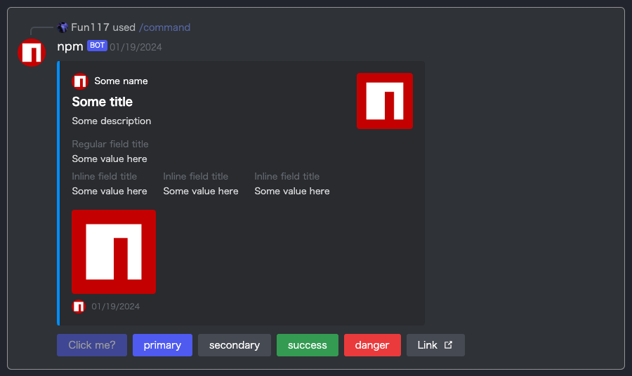

# DiscordMsg Component

[![NPM version][npm-version-image]][npm-url]
[![NPM downloads][npm-downloads-image]][npm-downloads-url]
[![MIT License][license-image]][license-url]

The DiscordMsg component is a React component designed to represent Discord-style messages and interactions. This versatile and extensible component is designed to easily integrate messages, buttons, and interactive elements, allowing developers to seamlessly create Discord-style user interfaces.

## Language

- [English](./en.md)
- [日本語](./ja.md)

## Package Information

For the latest package information, please check the [GitHub readme](https://github.com/Fun117/discord-messages-ui#readme).

Packages below version `v0.1.8` may not function correctly. Be sure to update to at least `v0.1.8`.

# Table of Contents

- [DiscordMsg Component](#discordmsg-component)
- [Table of Contents](#table-of-contents)
- [Installation](#installation)
    - [npm](#npm)
    - [yarn](#yarn)
    - [Component not generated?](#component-not-generated)
- [Change Log](#change-log)
- [Usage](#usage)
    - [UI](#ui)
    - [Sample Code](#sample-code)
- [Tutorial UI Creation](#tutorial-ui-creation)
    - [Step 1](#step1)
    - [Step 2](#step2)
    - [Step 3](#step3)
    - [Step 4](#step4)
    - [Step 5](#step5)
    - [Step 6](#step6)
- [Embeds](#embeds)
    - [UI](#embeds-ui)
    - [Sample Code](#embeds-sample-code)
- [Embeds Guide](#embeds-guide)
    - [Adding Author Information](#embeds---adding-author-information)
    - [Adding Embed Title](#embeds---adding-embed-title)
    - [Adding Embed Description](#embeds---adding-embed-description)
    - [Adding Icon](#embeds---adding-icon)
    - [Adding Content](#embeds---adding-content)
    - [Adding Thumbnail](#embeds---adding-thumbnail)
    - [Adding Fields](#embeds---adding-fields)
- [Format Classes](#format-classes)
    - [Mention](#mention)
    - [Backquote](#backquote)
- [Advantages](#advantages)
- [Contributors](#contributors)

<hr/>

# Installation

## npm

```bash
npm i discord-msg-ui-beta
```

## yarn

```bash
yarn add discord-msg-ui-beta
```

## Component not generated?

Run the following command in the project's root directory:

```bash
node ./node_modules/discord-msg-ui-beta/install-package.js
```

<hr/>

# Change Log

- 0.1.0
    - Added message display module
- 0.1.1
    - Added Japanese version to README
    - Corrected repository URL
- 0.1.2
    - Added code to prompt for installation directory
    - Added description
- 0.1.3 ~ 0.1.9
- 0.2.0
    - Added Embeds
    - Added ability to add Embeds component or HTML element as content
- 0.2.1
    - Fixed error issues

<hr/>

# Usage

## UI


## Sample Code
```tsx
<DiscordMsg type="messages">
    <DiscordMsg type="message" mention={true}>
        <DiscordMsg type="interaction" cmdName={`command`} userName={`Fun117`} iconUrl={`/assets/img/@Fun117_icon.png`}/>
        <DiscordMsg type="content" mode="group">
            <DiscordMsg type="content" mode="logo" iconUrl={`https://static-production.npmjs.com/58a19602036db1daee0d7863c94673a4.png`}/>
            <DiscordMsg type="content" mode="body">
                <DiscordMsg type="content" mode="bot" userName="npm"/>
                <DiscordMsg type="content" mode="msg">
                    @user Description
                </DiscordMsg>
                <DiscordMsg type="content" mode="buttons">
                    <DiscordMsg type="button" mode="primary" event="false">Click me?</DiscordMsg>
                    <DiscordMsg type="button" mode="primary">Primary</DiscordMsg>
                    <DiscordMsg type="button" mode="secondary">Secondary</DiscordMsg>
                    <DiscordMsg type="button" mode="success">Success</DiscordMsg>
                    <DiscordMsg type="button" mode="danger">Danger</DiscordMsg>
                    <DiscordMsg type="button" mode="link" content={`https://google.com`}>Link</DiscordMsg>
                </DiscordMsg>
            </DiscordMsg>
        </DiscordMsg>
    </DiscordMsg>
</DiscordMsg>
```

# Tutorial UI Creation

Use the `DiscordMsg` component to create a Discord-style UI for your React-based project. This tutorial explains the steps to build a simple and dynamic Discord-style interface for your project.

## Message Group
- Used to group multiple message components.
```tsx
<DiscordMsg type="messages">
    {/* Include individual message components here */}
</DiscordMsg>
```

## Message
- Used to represent individual messages.
- Include the `mention` property if mentioning someone in the message.
```tsx
<DiscordMsg type="message" mention={true}>
    {/* Include content, interaction, or buttons here */}
</DiscordMsg>
```

## Interaction
- Used to display interactions, such as using a command.
- Include the `cmdName`, `userName`, and `iconUrl` properties.
```tsx
<DiscordMsg type="interaction" cmdName={`command`} userName={`Fun117`} iconUrl={`/assets/img/@Fun117_icon.png`}/>
```

## Content
- Used to display the content of the message.
- Specify the mode as `group`, `logo`, `body`, or `buttons`.
- Use nested `DiscordMsg` components for structured content.
```tsx
<DiscordMsg type="content" mode="group">
    {/* Include nested content components here */}
</DiscordMsg>
```

## Button
- Used for clickable buttons.
- Specify the mode as `primary`, `secondary`, `success`, `danger`, or `link`.
- Optionally add the `event` property to disable the button.
```tsx
<DiscordMsg type="button" mode="primary" event="false">Click me?</DiscordMsg>
```

## Example
- Use the `DiscordMsg` component to assemble the components needed for a Discord-style UI.
```tsx
<DiscordMsg type="messages">
    <DiscordMsg type="message" mention={true}>
        <DiscordMsg type="interaction" cmdName={`command`} userName={`Fun117`} iconUrl={`/assets/img/@Fun117_icon.png`}/>


        <DiscordMsg type="content" mode="group">
            <DiscordMsg type="content" mode="logo" iconUrl={`https://static-production.npmjs.com/58a19602036db1daee0d7863c94673a4.png`}/>
            {/* Add more content components as needed */}
        </DiscordMsg>
    </DiscordMsg>
</DiscordMsg>
```

Now you know how to use the `DiscordMsg` component to create a Discord-style UI. Customize these examples to deploy them according to your project requirements.

# Embeds

To use Embeds, add the component within the content [body](#sample-code) element.

```tsx
<DiscordMsg type="content" mode="body">
    ...
    {/* Embeds component */}
    ...
</DiscordMsg>
```

## Embeds UI



## Embeds Sample Code

```tsx
<DiscordMsgEmbed type="embed" color={`rgb(0, 153, 255)`}>
    <DiscordMsgEmbed type="contents">
        <DiscordMsgEmbed type="div">
            <DiscordMsgEmbed type="contents" mode="author">
                <DiscordMsgEmbed type="contents" mode="author-icon" content={`https://static-production.npmjs.com/58a19602036db1daee0d7863c94673a4.png`}/>
                <DiscordMsgEmbed type="link" content={`https://static-production.npmjs.com/58a19602036db1daee0d7863c94673a4.png`}>
                    Some name
                </DiscordMsgEmbed>
            </DiscordMsgEmbed>
            <DiscordMsgEmbed type="contents" mode="title">
                Some title
            </DiscordMsgEmbed>
            <DiscordMsgEmbed type="contents" mode="description">
                Some description
            </DiscordMsgEmbed>
            <DiscordMsgEmbed type="contents" mode="fields">
                <DiscordMsgEmbed type="contents" mode="field">
                    <DiscordMsgEmbed type="contents" mode="field-title">
                        Regular field title
                    </DiscordMsgEmbed>
                    Some value here
                </DiscordMsgEmbed>
                <DiscordMsgEmbed type="contents" mode="addFields">
                    <DiscordMsgEmbed type="contents" mode="field-title">
                        Inline field title
                    </DiscordMsgEmbed>
                    Some value here
                </DiscordMsgEmbed>
                <DiscordMsgEmbed type="contents" mode="addFields">
                    <DiscordMsgEmbed type="contents" mode="field-title">
                        Inline field title
                    </DiscordMsgEmbed>
                    Some value here
                </DiscordMsgEmbed>
                <DiscordMsgEmbed type="contents" mode="addFields">
                    <DiscordMsgEmbed type="contents" mode="field-title">
                        Inline field title
                    </DiscordMsgEmbed>
                    Some value here
                </DiscordMsgEmbed>
            </DiscordMsgEmbed>
            <DiscordMsgEmbed type="contents" mode="icon" content={`https://static-production.npmjs.com/58a19602036db1daee0d7863c94673a4.png`}/>
        </DiscordMsgEmbed>
        <DiscordMsgEmbed type="contents" mode="thumbnail" content={`https://static-production.npmjs.com/58a19602036db1daee0d7863c94673a4.png`}/>
    </DiscordMsgEmbed>
    <DiscordMsgEmbed type="footer">
        <DiscordMsgEmbed type="footer" mode="icon" content={`https://static-production.npmjs.com/58a19602036db1daee0d7863c94673a4.png`}/>
        <DiscordMsgEmbed type="footer" mode="content">
            <DiscordMsgEmbed type="timestamp"/>
        </DiscordMsgEmbed>
    </DiscordMsgEmbed>
</DiscordMsgEmbed>
```

# Embeds Guide

Embeds are a feature to enrich the design of Discord messages. Here is a sample code using Embeds and its explanation.

### Basic Structure of Embeds

```tsx
<DiscordMsgEmbed type="embed" color={`rgb(0, 153, 255)`}>
    {/* Add content here */}
</DiscordMsgEmbed>
```

### Embeds - Adding Content

You can add various content inside Embeds. Below are samples of representative content.

## Embeds - Adding Author Information
```tsx
<DiscordMsgEmbed type="contents" mode="author">
    <DiscordMsgEmbed type="contents" mode="author-icon" content={`Author's icon URL`}/>
    <DiscordMsgEmbed type="link" content={`Author's link URL`}>
        Author's name
    </DiscordMsgEmbed>
</DiscordMsgEmbed>
```

## Adding Embed Title
```tsx
<DiscordMsgEmbed type="contents" mode="title">
    Content of the title
</DiscordMsgEmbed>
```

## Adding Embed Description
```tsx
<DiscordMsgEmbed type="contents" mode="description">
    Content of the description
</DiscordMsgEmbed>
```

## Adding Fields
```tsx
<DiscordMsgEmbed type="contents" mode="fields">
    {/* Add fields here */}
</DiscordMsgEmbed>
```

## Embeds - Adding Icon
```tsx
<DiscordMsgEmbed type="contents" mode="icon" content={`Icon's URL`}/>
```

## Embeds - Adding Thumbnail
```tsx
<DiscordMsgEmbed type="contents" mode="thumbnail" content={`Thumbnail's URL`}/>
```

## Embeds - Adding Fields

To add fields inside Embeds, you can do so as follows:

```tsx
<DiscordMsgEmbed type="contents" mode="fields">
    <DiscordMsgEmbed type="contents" mode="field">
        <DiscordMsgEmbed type="contents" mode="field-title">
            Field's title
        </DiscordMsgEmbed>
        Field's content
    </DiscordMsgEmbed>
    {/* Other fields can be added similarly */}
</DiscordMsgEmbed>
```

### Adding Footer
You can add a footer at the end of Embeds.

```tsx
<DiscordMsgEmbed type="footer">
    <DiscordMsgEmbed type="footer" mode="icon" content={`Footer's icon URL`}/>
    <DiscordMsgEmbed type="footer" mode="content">
        <DiscordMsgEmbed type="timestamp"/>
    </DiscordMsgEmbed>
</DiscordMsgEmbed>
```

<hr/>

# Format Classes

## Mention

The string is displayed as a mention. This feature emulates Discord's mention UI.

```tsx
<span className="discord-mention">TEXT</span>
```

## Backquote (Backtilde)

The string is displayed as code. This feature is useful for embedding programming language or code snippets within text. It can also be used to emphasize text with a specific style.

```tsx
<span className="markdown-code">TEXT</span>
```

# Advantages

- High readability
- Easily customizable
- Dynamically resizable
- Can be created with short code

# Contributors

- [Fun117](https://github.com/fun117)

**Translation: ChatGPT 3.5**

[npm-version-image]: https://badge.fury.io/js/discord-msg-ui-beta.svg
[npm-url]: https://www.npmjs.com/package/discord-msg-ui-beta
[npm-version-image]: https://img.shields.io/npm/v/discord-msg-ui-beta.svg?style=flat
[npm-url]: https://npmjs.org/package/discord-msg-ui-beta
[npm-downloads-image]: https://img.shields.io/npm/dt/discord-msg-ui-beta.svg?style=flat
[npm-downloads-url]: https://npmcharts.com/compare/discord-msg-ui-beta?minimal=true
[license-image]: https://img.shields.io/badge/license-MIT-blue.svg?style=flat
[license-url]: ../LICENSE.txt