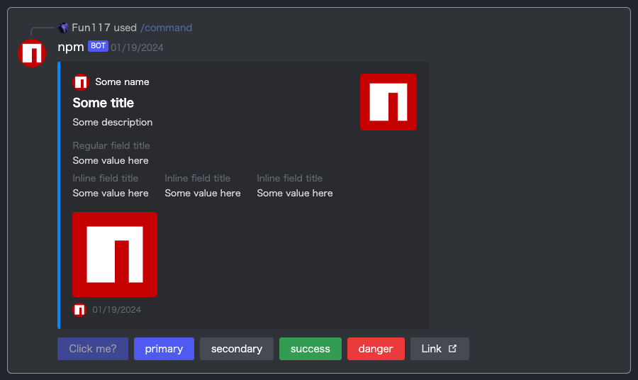

# DiscordMsg コンポーネント

[![NPM version][npm-version-image]][npm-url]
[![NPM downloads][npm-downloads-image]][npm-downloads-url]
[![MIT License][license-image]][license-url]

DiscordMsg コンポーネントは、Discord スタイルのメッセージとインタラクションを表現するための React コンポーネントです。この多目的かつ拡張可能なコンポーネントは、メッセージ、ボタン、および対話的な要素を簡単に統合できるように設計されており、開発者は Discord 風のユーザーインターフェースをシームレスに作成できます。

## language

- [English](./en.md)
- [日本語](./ja.md)

## パッケージ情報

最新のパッケージ情報は[GitHubのreadme](https://github.com/Fun117/discord-messages-ui#readme)を確認してください。

パッケージ `v0.1.8` 以降は正常に機能しない可能性があります。必ず `v0.1.8` 以上にアップデートしてください。

# 目次

-  [DiscordMsg コンポーネント](#discordmsg-コンポーネント)
-  [目次](#目次)
-  [インストール](#インストール)
    -  [npm](#npm)
    -  [yarn](#yarn)
    -  [コンポーネントが生成されない？](#コンポーネントが生成されない)
-  [変更履歴](#変更履歴)
-  [使用方法](#使用方法)
    -  [UI](#ui)
    -  [サンプルコード](#サンプルコード)
-  [チュートリアル UI 作成](#チュートリアル-ui-作成)
    -  [step1](#メッセージグループ)
    -  [step2](#メッセージ)
    -  [step3](#インタラクション)
    -  [step4](#コンテンツ)
    -  [step5](#ボタン)
    -  [step6](#使用例)
-  [Embeds](#embeds)
    -  [UI](#embeds-ui)
    -  [サンプルコード](#embedsサンプルコード)
-  [Embedsのガイド](#embedsのガイド)
    -  [Author情報の追加](#embeds---author情報の追加)
    -  [embedのタイトルの追加](#embedのタイトルの追加)
    -  [embedの説明の追加](#embedの説明の追加)
    -  [アイコンの追加](#embeds---アイコンの追加)
    -  [コンテンツの追加](#embeds---コンテンツの追加)
    -  [サムネイルの追加](#embeds---サムネイルの追加)
    -  [フィールドの追加](#embeds---フィールドの追加)
-  [書式クラス](#書式クラス)
    -  [メンション](#メンション)
    -  [バッククオート](#バッククオートバックチルダ)
-  [利点](#利点)
-  [貢献者](#貢献者)

<hr/>

# インストール

## npm

```bash
npm i discord-msg-ui-beta
```

## yarn

```bash
yarn add discord-msg-ui-beta
```

## コンポーネントが生成されない？

プロジェクトのルートディレクトリーで以下のコマンドを実行することで生成されます。

```bash
node ./node_modules/discord-msg-ui-beta/install-package.js
```

<hr/>

# 変更履歴

-  0.1.0
    - メッセージ表示用モジュールを追加
-  0.1.1
    - READMEに日本語版を追加
    - リポジトリURLを修正
-  0.1.2
    - インストールディレクトを尋ねるコードの追加
    - descriptionを追加
-  0.1.3 ~ 0.1.9
-  0.2.0
    - Embedsを追加
    - EmbedsコンポーネントまたはHTML要素をコンテンツとして追加できる機能を追加
- 0.2.1
    - エラー問題を修正

<hr/>

# 使用方法

## UI


## サンプルコード
```tsx
<DiscordMsg type="messages">
    <DiscordMsg type="message" mention={true}>
        <DiscordMsg type="interaction" cmdName={`command`} userName={`Fun117`} iconUrl={`/assets/img/@Fun117_icon.png`}/>
        <DiscordMsg type="content" mode="group">
            <DiscordMsg type="content" mode="logo" iconUrl={`https://static-production.npmjs.com/58a19602036db1daee0d7863c94673a4.png`}/>
            <DiscordMsg type="content" mode="body">
                <DiscordMsg type="content" mode="bot" userName="npm"/>
                <DiscordMsg type="content" mode="msg">
                    @user 説明
                </DiscordMsg>
                <DiscordMsg type="content" mode="buttons">
                    <DiscordMsg type="button" mode="primary" event="false">Click me?</DiscordMsg>
                    <DiscordMsg type="button" mode="primary">primary</DiscordMsg>
                    <DiscordMsg type="button" mode="secondary">secondary</DiscordMsg>
                    <DiscordMsg type="button" mode="success">success</DiscordMsg>
                    <DiscordMsg type="button" mode="danger">danger</DiscordMsg>
                    <DiscordMsg type="button" mode="link" content={`https://google.com`}>Link</DiscordMsg>
                </DiscordMsg>
            </DiscordMsg>
        </DiscordMsg>
    </DiscordMsg>
</DiscordMsg>
```

# チュートリアル UI 作成

`DiscordMsg` コンポーネントを使用して Discord スタイルの UI を作成するためのチュートリアルへようこそ。このチュートリアルでは、React ベースのプロジェクトに対してシンプルで動的な Discord 風のインターフェースを構築する手順が説明されています。

## メッセージグループ
- 複数のメッセージコンポーネントをグループ化するために使用します。
```tsx
<DiscordMsg type="messages">
    {/* 個々のメッセージコンポーネントをここに含めます */}
</DiscordMsg>
```

## メッセージ
- 個々のメッセージを表現するために使用します。
- メッセージに誰かをメンションする場合は `mention` プロパティを追加します。
```tsx
<DiscordMsg type="message" mention={true}>
    {/* コンテンツ、インタラクション、またはボタンをここに含めます */}
</DiscordMsg>
```

## インタラクション
- コマンドの使用など、インタラクションを表示するために使用します。
- `cmdName` `userName` および `iconUrl` プロパティを含めます。
```tsx
<DiscordMsg type="interaction" cmdName={`command`} userName={`Fun117`} iconUrl={`/assets/img/@Fun117_icon.png`}/>
```

## コンテンツ
- メッセージのコンテンツを表示するために使用します。
- モードを `group` `logo` `body` または `buttons` として指定します。
- 構造化されたコンテンツのためにネストされた `DiscordMsg` コンポーネントを使用します。
```tsx
<DiscordMsg type="content" mode="group">
    {/* ネストされたコンテンツコンポーネントをここに含めます */}
</DiscordMsg>
```

## ボタン
- クリック可能なボタンに使用します。
- モードを `primary` `secondary` `success` `danger` または `link` として指定します。
- 必要に応じて `event` プロパティを追加してボタンを無効にします。
```tsx
<DiscordMsg type="button" mode="primary" event="false">Click me?</DiscordMsg>
```

## 使用例
- `DiscordMsg` コンポーネントを使用して Discord 風の UI に必要なコンポーネントを組み立てます。
```tsx
<DiscordMsg type="messages">
    <DiscordMsg type="message" mention={true}>
        <DiscordMsg type="interaction" cmdName={`command`} userName={`Fun117`} iconUrl={`/assets/img/@Fun117_icon.png`}/>
        <DiscordMsg type="content" mode="group">
            <DiscordMsg type="content" mode="logo" iconUrl={`https://static-production.npmjs.com/58a19602036db1daee0d7863c94673a4.png`}/>
            {/* 必要に応じてさらにコンテンツコンポーネントを追加します */}
        </DiscordMsg>
    </DiscordMsg>
</DiscordMsg>
```

これで、`DiscordMsg` コンポーネントを使用して Discord 風の UI を作成する手順が分かりました。これらの例をカスタマイズしてプロジェクトの要件に合わせて展開してください。

# Embeds

Embedsを使用するにはコンテンツ[body](#サンプルコード)要素の中にコンポーネントを追加します。

```tsx
<DiscordMsg type="content" mode="body">
    ...
    {/* Embedsコンポーネント */}
    ...
</DiscordMsg>
```

## Embeds UI



## Embedsサンプルコード

```tsx
<DIscordMsgEmbed type="embed" color={`rgb(0, 153, 255)`}>
    <DIscordMsgEmbed type="contents">
        <DIscordMsgEmbed type="div">
            <DIscordMsgEmbed type="contents" mode="author">
                <DIscordMsgEmbed type="contents" mode="author-icon" content={`https://static-production.npmjs.com/58a19602036db1daee0d7863c94673a4.png`}/>
                <DIscordMsgEmbed type="link" content={`https://static-production.npmjs.com/58a19602036db1daee0d7863c94673a4.png`}>
                    Some name
                </DIscordMsgEmbed>
            </DIscordMsgEmbed>
            <DIscordMsgEmbed type="contents" mode="title">
            Some title
            </DIscordMsgEmbed>
            <DIscordMsgEmbed type="contents" mode="description">
            Some description
            </DIscordMsgEmbed>
            <DIscordMsgEmbed type="contents" mode="fields">
                <DIscordMsgEmbed type="contents" mode="field">
                    <DIscordMsgEmbed type="contents" mode="field-title">
                    Regular field title
                    </DIscordMsgEmbed>
                    Some value here
                </DIscordMsgEmbed>
                <DIscordMsgEmbed type="contents" mode="addFields">
                    <DIscordMsgEmbed type="contents" mode="field-title">
                    Inline field title
                    </DIscordMsgEmbed>
                    Some value here
                </DIscordMsgEmbed>
                <DIscordMsgEmbed type="contents" mode="addFields">
                    <DIscordMsgEmbed type="contents" mode="field-title">
                    Inline field title
                    </DIscordMsgEmbed>
                    Some value here
                </DIscordMsgEmbed>
                <DIscordMsgEmbed type="contents" mode="addFields">
                    <DIscordMsgEmbed type="contents" mode="field-title">
                    Inline field title
                    </DIscordMsgEmbed>
                    Some value here
                </DIscordMsgEmbed>
            </DIscordMsgEmbed>
            <DIscordMsgEmbed type="contents" mode="icon" content={`https://static-production.npmjs.com/58a19602036db1daee0d7863c94673a4.png`}/>
        </DIscordMsgEmbed>
        <DIscordMsgEmbed type="contents" mode="thumbnail" content={`https://static-production.npmjs.com/58a19602036db1daee0d7863c94673a4.png`}/>
    </DIscordMsgEmbed>
    <DIscordMsgEmbed type="footer">
        <DIscordMsgEmbed type="footer" mode="icon" content={`https://static-production.npmjs.com/58a19602036db1daee0d7863c94673a4.png`}/>
        <DIscordMsgEmbed type="footer" mode="content">
            <DIscordMsgEmbed type="timestamp"/>
        </DIscordMsgEmbed>
    </DIscordMsgEmbed>
</DIscordMsgEmbed>
```

# Embedsのガイド

Embedsは、Discordメッセージのデザインをより豊かにするための機能です。以下は、Embedsを使用したコードのサンプルとその説明です。

### Embedsの基本構造

Embedsは、以下のように基本的な構造を持っています。

```tsx
<DIscordMsgEmbed type="embed" color={`rgb(0, 153, 255)`}>
    {/* コンテンツの追加 */}
</DIscordMsgEmbed>
```

### Embeds - コンテンツの追加

Embeds内には、様々なコンテンツを追加できます。以下は、代表的なコンテンツのサンプルです。

## Embeds - Author情報の追加
```tsx
<DIscordMsgEmbed type="contents" mode="author">
    <DIscordMsgEmbed type="contents" mode="author-icon" content={`AuthorのアイコンURL`}/>
    <DIscordMsgEmbed type="link" content={`AuthorのリンクURL`}>
        Authorの名前
    </DIscordMsgEmbed>
</DIscordMsgEmbed>
```

## Embedのタイトルの追加
```tsx
<DIscordMsgEmbed type="contents" mode="title">
    タイトルの内容
</DIscordMsgEmbed>
```

## Embedの説明の追加
```tsx
<DIscordMsgEmbed type="contents" mode="description">
    説明の内容
</DIscordMsgEmbed>
```

## Embedのフィールドの追加
```tsx
<DIscordMsgEmbed type="contents" mode="fields">
    {/* フィールドの追加 */}
</DIscordMsgEmbed>
```

## Embeds - アイコンの追加
```tsx
<DIscordMsgEmbed type="contents" mode="icon" content={`アイコンのURL`}/>
```

## Embeds - サムネイルの追加
```tsx
<DIscordMsgEmbed type="contents" mode="thumbnail" content={`サムネイルのURL`}/>
```

## Embeds - フィールドの追加

Embeds内でフィールドを追加する場合、以下のように追加できます。

```tsx
<DIscordMsgEmbed type="contents" mode="fields">
    <DIscordMsgEmbed type="contents" mode="field">
        <DIscordMsgEmbed type="contents" mode="field-title">
            フィールドのタイトル
        </DIscordMsgEmbed>
        フィールドの内容
    </DIscordMsgEmbed>
    {/* 他のフィールドも同様に追加可能 */}
</DIscordMsgEmbed>
```

### フッターの追加
Embedsの最後にフッターを追加できます。

```tsx
<DIscordMsgEmbed type="footer">
    <DIscordMsgEmbed type="footer" mode="icon" content={`フッターのアイコンURL`}/>
    <DIscordMsgEmbed type="footer" mode="content">
        <DIscordMsgEmbed type="timestamp"/>
    </DIscordMsgEmbed>
</DIscordMsgEmbed>
```

<hr/>

# 書式クラス

## メンション

文字列がメンションとして表示されます。この機能はDiscordのメンションのUIです。

```tsx
<span className="discord-mention">TEXT</span>
```

## バッククオート（バックチルダ）

文字列がコードとして表示されます。この機能は、プログラミング言語やコードの一部を文章中に埋め込む際に便利です。また、コード以外にもテキストを特定のスタイルで強調したい場合にも使用できます。

```tsx
<span className="markdown-code">TEXT</span>
```

# 利点

- 高い視認性
- 簡単にカスタマイズ可能
- 動的にリサイズ可能
- 短いコードで作成可能

# 貢献者

-  [Fun117](https://github.com/fun117)

**Translation: ChatGPT 3.5**

[npm-version-image]: https://badge.fury.io/js/discord-msg-ui-beta.svg
[npm-url]: https://www.npmjs.com/package/discord-msg-ui-beta
[npm-version-image]: https://img.shields.io/npm/v/discord-msg-ui-beta.svg?style=flat
[npm-url]: https://npmjs.org/package/discord-msg-ui-beta
[npm-downloads-image]: https://img.shields.io/npm/dt/discord-msg-ui-beta.svg?style=flat
[npm-downloads-url]: https://npmcharts.com/compare/discord-msg-ui-beta?minimal=true
[license-image]: https://img.shields.io/badge/license-MIT-blue.svg?style=flat
[license-url]: ../LICENSE.txt