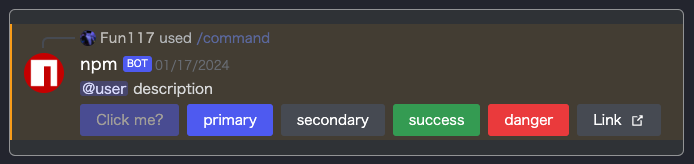

# DiscordMsg コンポーネント

[![MIT License][license-image]][license-url]

DiscordMsg コンポーネントは、Discord スタイルのメッセージとインタラクションを表現するための React コンポーネントです。この多目的かつ拡張可能なコンポーネントは、メッセージ、ボタン、および対話的な要素を簡単に統合できるように設計されており、開発者は Discord 風のユーザーインターフェースをシームレスに作成できます。

## language

- [English](./en.md)
- [日本語](./ja.md)

# 目次

-  [DiscordMsg コンポーネント](#discordmsg-コンポーネント)
-  [目次](#目次)
-  [インストール](#インストール)
    -  [npm](#npm)
    -  [yarn](#yarn)
-  [変更履歴](#変更履歴)
-  [使用方法](#使用方法)
    -  [UI の構築](#ui-の構築)
    -  [サンプルコード](#サンプルコード)
-  [チュートリアル UI 作成](#チュートリアル-ui-作成)
    -  [step1](#メッセージグループ)
    -  [step2](#メッセージ)
    -  [step3](#インタラクション)
    -  [step4](#コンテンツ)
    -  [step5](#ボタン)
    -  [step6](#使用例)
-  [利点](#利点)
-  [貢献者](#貢献者)

# インストール

## npm

```bash
npm I discord-messages-ui
```

## yarn

```bash
yarn add discord-messages-ui
```

<hr/>

# 変更履歴

-  0.1.0
    - メッセージ表示用モジュールを追加
-  0.1.1
    - READMEに日本語版を追加
    - リポジトリURLを修正
-  0.1.2
    - インストールディレクトを尋ねるコードの追加
    - descriptionを追加
<hr/>

# 使用方法

## UI の構築




## サンプルコード
```tsx
<DiscordMsg type="messages">
    <DiscordMsg type="message" mention={true}>
        <DiscordMsg type="interaction" cmdName={`command`} userName={`Fun117`} iconUrl={`/assets/img/@Fun117_icon.png`}/>
        <DiscordMsg type="content" mode="group">
            <DiscordMsg type="content" mode="logo" iconUrl={`https://static-production.npmjs.com/58a19602036db1daee0d7863c94673a4.png`}/>
            <DiscordMsg type="content" mode="body">
                <DiscordMsg type="content" mode="bot" userName="npm"/>
                <DiscordMsg type="content" mode="msg">
                    @user 説明
                </DiscordMsg>
                <DiscordMsg type="content" mode="buttons">
                    <DiscordMsg type="button" mode="primary" event="false">Click me?</DiscordMsg>
                    <DiscordMsg type="button" mode="primary">primary</DiscordMsg>
                    <DiscordMsg type="button" mode="secondary">secondary</DiscordMsg>
                    <DiscordMsg type="button" mode="success">success</DiscordMsg>
                    <DiscordMsg type="button" mode="danger">danger</DiscordMsg>
                    <DiscordMsg type="button" mode="link" content={`https://google.com`}>Link</DiscordMsg>
                </DiscordMsg>
            </DiscordMsg>
        </DiscordMsg>
    </DiscordMsg>
</DiscordMsg>
```

# チュートリアル UI 作成

`DiscordMsg` コンポーネントを使用して Discord スタイルの UI を作成するためのチュートリアルへようこそ。このチュートリアルでは、React ベースのプロジェクトに対してシンプルで動的な Discord 風のインターフェースを構築する手順が説明されています。

## メッセージグループ
- 複数のメッセージコンポーネントをグループ化するために使用します。
```tsx
<DiscordMsg type="messages">
    {/* 個々のメッセージコンポーネントをここに含めます */}
</DiscordMsg>
```

## メッセージ
- 個々のメッセージを表現するために使用します。
- メッセージに誰かをメンションする場合は `mention` プロパティを追加します。
```tsx
<DiscordMsg type="message" mention={true}>
    {/* コンテンツ、インタラクション、またはボタンをここに含めます */}
</DiscordMsg>
```

## インタラクション
- コマンドの使用など、インタラクションを表示するために使用します。
- `cmdName` `userName` および `iconUrl` プロパティを含めます。
```tsx
<DiscordMsg type="interaction" cmdName={`command`} userName={`Fun117`} iconUrl={`/assets/img/@Fun117_icon.png`}/>
```

## コンテンツ
- メッセージのコンテンツを表示するために使用します。
- モードを `group` `logo` `body` または `buttons` として指定します。
- 構造化されたコンテンツのためにネストされた `DiscordMsg` コンポーネントを使用します。
```tsx
<DiscordMsg type="content" mode="group">
    {/* ネストされたコンテンツコンポーネントをここに含めます */}
</DiscordMsg>
```

## ボタン
- クリック可能なボタンに使用します。
- モードを `primary` `secondary` `success` `danger` または `link` として指定します。
- 必要に応じて `event` プロパティを追加してボタンを無効にします。
```tsx
<DiscordMsg type="button" mode="primary" event="false">Click me?</DiscordMsg>
```

## 使用例
- `DiscordMsg` コンポーネントを使用して Discord 風の UI に必要なコンポーネントを組み立てます。
```tsx
<DiscordMsg type="messages">
    <DiscordMsg type="message" mention={true}>
        <DiscordMsg type="interaction" cmdName={`command`} userName={`Fun117`} iconUrl={`/assets/img/@Fun117_icon.png`}/>
        <DiscordMsg type="content" mode="group">
            <DiscordMsg type="content" mode="logo" iconUrl={`https://static-production.npmjs.com/58a19602036db1daee0d7863c94673a4.png`}/>
            {/* 必要に応じてさらにコンテンツコンポーネントを追加します */}
        </DiscordMsg>
    </DiscordMsg>
</DiscordMsg>
```

これで、`DiscordMsg` コンポーネントを使用して Discord 風の UI を作成する手順が分かりました。これらの例をカスタマイズしてプロジェクトの要件に合わせて展開してください。

<hr/>

# 利点

- 高い視認性
- 簡単にカスタマイズ可能
- 動的にリサイズ可能
- 短いコードで作成可能

# 貢献者

-  [Fun117](https://github.com/fun117)

[license-image]: https://img.shields.io/badge/license-MIT-blue.svg?style=flat
[license-url]: ./LICENSE.txt